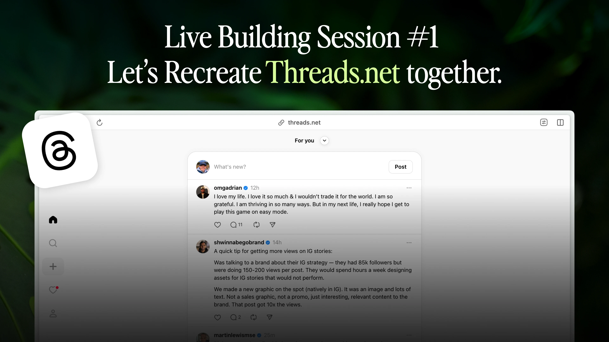

# Threads Clone

A responsive Threads clone built with Next.js and shadcn/ui.



## Quick Start Guide for Non-Technical Users

### How to Download and Run This Project

1. **Download the project from GitHub:**
   - Visit the GitHub repository page
   - Click the green "Code" button
   - Select "Download ZIP" from the dropdown menu
   - Save the ZIP file to your computer
   - Unzip the file by double-clicking on it

2. **Open the project in Cursor:**
   - Download and install [Cursor](https://cursor.sh/) if you don't have it
   - Open Cursor
   - Click "File" > "Open Folder" (or use Cmd+O on Mac, Ctrl+O on Windows)
   - Navigate to the unzipped project folder and select it

3. **Run the project locally:**
   - In Finder (Mac) or File Explorer (Windows), navigate to the project folder
   - Right-click in the folder and select "New Terminal at Folder" (Mac) or "Open in Terminal" (Windows)
   - In the terminal that opens, type `npm install` and press Enter
   - After installation completes, type `npm run dev` and press Enter
   - Open your web browser and go to http://localhost:3000

## About This Project

This project was created as a 1-hour live build demo using Cursor to recreate threads.net, inspired by [Pietro Schirano (@skirano on Twitter)](https://twitter.com/skirano).

You can find more information about the event at: [https://lu.ma/uwzria8i](https://lu.ma/uwzria8i)

I saw a great tweet/video from [@skirano](https://twitter.com/skirano) where he built some of the Threads.net UI, and so I thought I'd do the same as part of a series I'm putting together of live building with AI.

The files are open-source so you can download and continue experimenting with it if you like.

Learn how to build using AI: [buildwithaicourse.com](https://buildwithaicourse.com)  
Book a call with me: [https://cal.com/october/30min](https://cal.com/october/30min)

## Features

- 🌓 Light, dark, and "Crazy" theme support
- 📱 Fully responsive design
- 🧩 Modular components using shadcn/ui
- 🔄 Tab-based navigation
- 👤 User profiles
- 🔔 Notifications system
- 🔍 Explore page
- 🎉 Interactive hover effects

## Tech Stack

- [Next.js 15](https://nextjs.org/) - React framework
- [React 19](https://react.dev/) - UI library
- [Tailwind CSS 4](https://tailwindcss.com/) - CSS framework
- [shadcn/ui](https://ui.shadcn.com/) - UI component library
- [Lucide React](https://lucide.dev/) - Icon library
- [next-themes](https://github.com/pacocoursey/next-themes) - Theme management

## Getting Started

### Prerequisites

- Node.js 18.17 or later
- npm or yarn

### Installation

1. Clone the repository:

```bash
git clone https://github.com/yourusername/threads-clone.git
cd threads-clone
```

2. Install dependencies:

```bash
npm install
# or
yarn install
```

3. Run the development server:

```bash
npm run dev
# or
yarn dev
```

4. Open [http://localhost:3000](http://localhost:3000) in your browser to see the result.

## Project Structure

```
threads-clone/
├── src/
│   ├── app/                 # Next.js App Router
│   │   ├── explore/         # Explore page
│   │   ├── notifications/   # Notifications page
│   │   ├── profile/         # Profile page
│   │   ├── globals.css      # Global styles
│   │   ├── layout.tsx       # Root layout
│   │   └── page.tsx         # Home page
│   ├── components/          # React components
│   │   ├── ui/              # shadcn/ui components
│   │   ├── navbar.tsx       # Navigation bar
│   │   ├── theme-provider.tsx # Theme provider
│   │   └── theme-toggle.tsx # Theme toggle button
│   └── lib/                 # Utility functions
├── public/                  # Static assets
├── tailwind.config.ts       # Tailwind CSS configuration
└── components.json          # shadcn/ui configuration
```

## Customization

### Themes

The app uses CSS variables for theming. You can customize the colors in `src/app/globals.css`. Three themes are available:

- **Light**: Clean, bright interface for daytime use
- **Dark**: Eye-friendly dark mode for nighttime use
- **Crazy**: Vibrant, colorful theme with bold purples and greens

### Animations

The app includes several interactive animations:

- **Image Hover Effects**: Subtle spring scaling effect when hovering over images

### Components

All UI components are from shadcn/ui and can be customized. See the [shadcn/ui documentation](https://ui.shadcn.com/docs) for more information.

## License

This project is licensed under the MIT License - see the LICENSE file for details.
